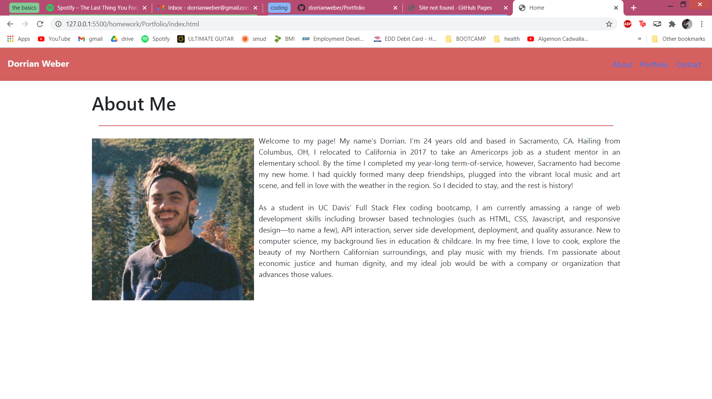
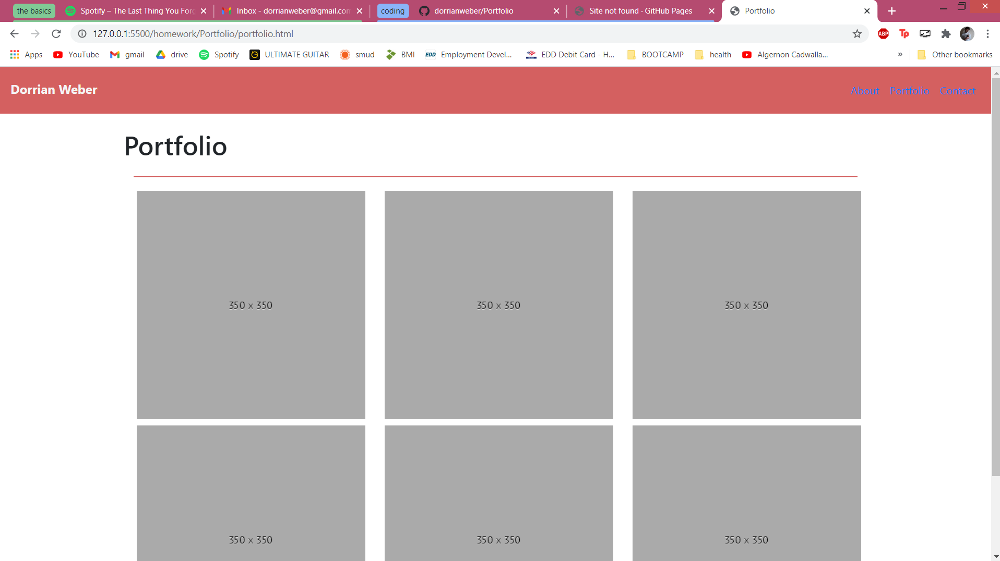
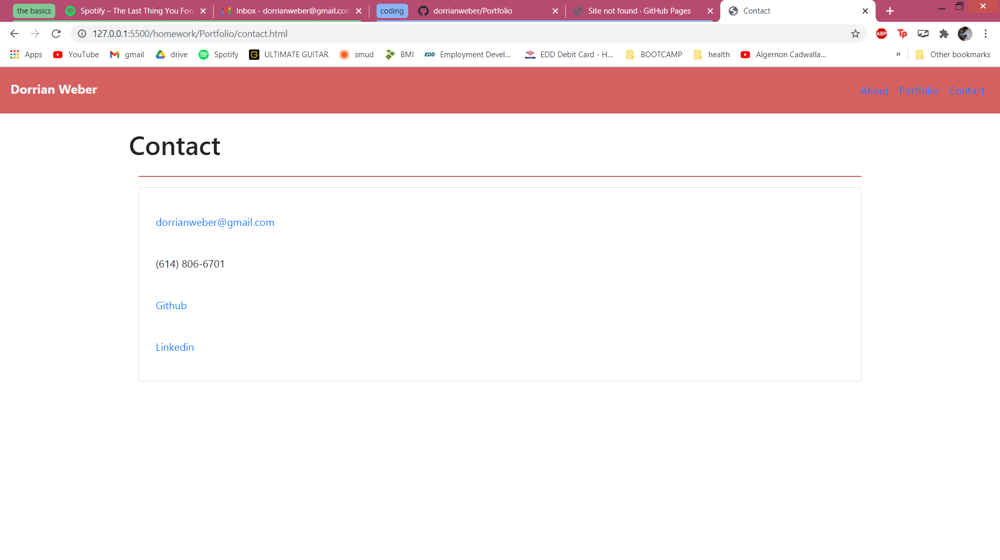

# Portfolio


# The Assignment
The task for this homework assignment was to create a personal portfolio site with three pages:

* An "About Me" page, with a short bio and a photo
* A "Portfolio" page, with images of different projects
* A "Contact" page, with our personal contact information

Additionally, a functional & consistent navigation bar was required.

The main thing to focus on here was _responsive design_ and _mobile compatability_--essentially, making sure that the website looked good on windows of any size, including smartphone screens.

# Issues
* At the onset, I was trying to add a contact form (like the one I describe below in the "Looking Forward" section of this README), which proved to be really complicated and outside of the realm of my knowledge at this point in the course. After a lot of frustruating failed attempts, I decided to forget about that for the time being & go with a more simple route for the "Contact" page.

* The text on my "About Me" page wasn't wrapping around the image. This turned out to be because I had the paragraph and the image in separate columns.

* On the "Portfolio" page, I couldn't figure out at first how to get space in-between each image. This was a simple fix, but it went over my head initially.

* A lot of funky issues cropped up with image sizing on the "Portfolio" page & text overlapping my photo on the "About Me" page, which turned out to be partially the fault of my over-zealous use of the "card" Bootstrap component. Things cleared up  when I pared that down to only what was necessary.

* The bane of my existence was trying to get the links in the Navbar to stay horizontal & properly spaced for windows below 576 pixels, instead of shifting to a vertical column. Finally, I saw using Chrome DevTools that there was this "flex direction" variable that was set to "row" on larger screens & "column" in X-Small windows. So I used a media query in my CSS to override that & threw in a small margin on the nav items to ensure proper spacing (without doing this, the links were successfully oriented side-by-side but were all squished together).

```
/* Media query for only X-Small windows... */
@media only screen and (max-width: 576px) {
    .navbar-nav {
        flex-direction: row;
    }
    .nav-item {
        margin: 10px;
    }
}
```


# Looking Forward

In the future, I want to:
* Make the site a lot prettier. This is just a starting point. I do want to use this site for my portfolio for prospective employers, so throughout the course I plan on periodically coming back and updating the app with the new skills I've developed--making it more clean & professional with each update.
* Add a functional "Contact Me" form where the user can type in their name, email address, phone number, & a message, hit submit, & an email will be sent to my address all without needing to open a separate application or Gmail window.
* Perhaps change the "Portfolio" page so that the images are rendered larger & in a "carousel" or something--a prettier & more immersive way to scroll through examples of my work.

<!-- Screenshot of working application -->





# Installation

Simply follow this link and view the webpage.

https://dorrianweber.github.io/Portfolio/

# Usage

Clicking the three links on the right-hand side of the navigation bar takes you to the corresponding pages.

On the "Contact" page, clicking on my email address will pull up a composition box through your default email application, ready to send to me with the click of a button.

Clicking on the Linkedin or Github links will pull up my profiles on the respective site.


# Credits

A big thanks to my TA Ryan Skog for helping me out with this project in our tutoring session on January 4th.